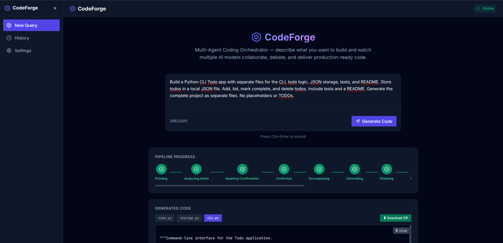
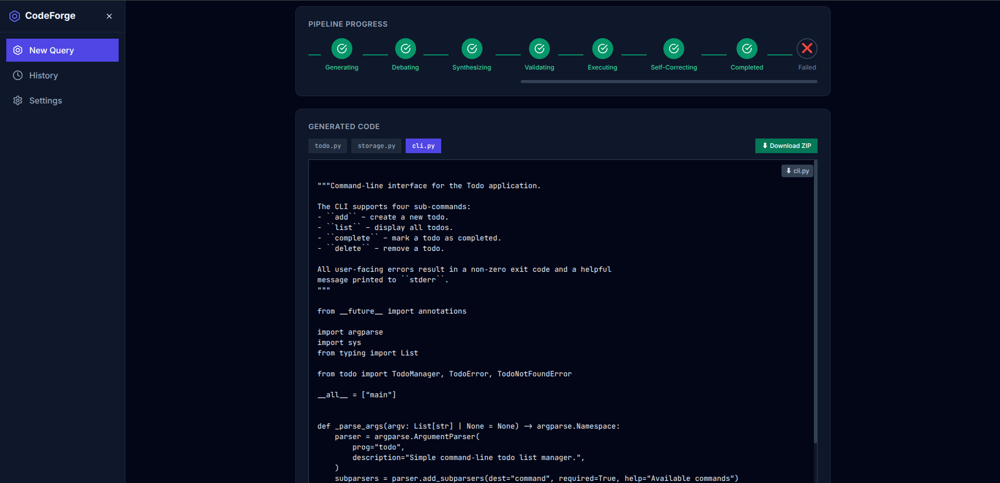
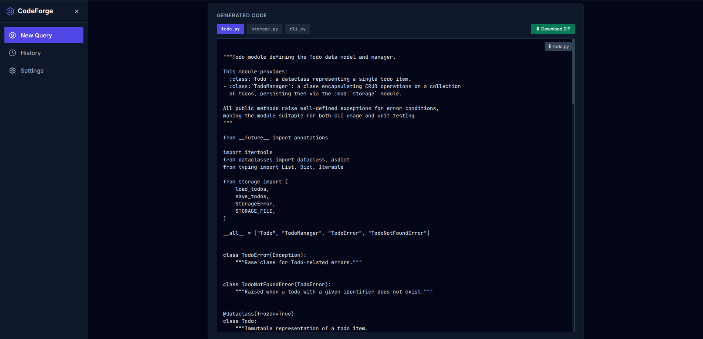

# CodeForge — Multi-Agent Coding Orchestrator

> **A multi-agent AI software engineering platform that decomposes coding tasks, routes work across different LLMs and APIs, collects and reasons over their results, validates the solutions, and combines the strongest results into a structured software project.**

CodeForge is built around a simple idea: **no single model has to do everything.**

A natural-language software request can be broken into smaller tasks and routed to different AI models or external APIs based on the work required. CodeForge collects the resulting outputs, compares and reasons over them, validates the generated code, and combines the results into a coherent, structured multi-file project.

The system is designed to work across multiple model providers and model families, including **OpenAI GPT, Anthropic Claude, Qwen, Kimi, DeepSeek, Groq, and Google Gemini**, through a common provider abstraction.

The final output is not simply an LLM response. It is a **structured project that has passed the applicable generation, reasoning, extraction, validation, and testing stages** before being presented through the CodeForge dashboard.

---

## Full Demo

**[▶ Watch the CodeForge Demonstration](assets/codeforge-demo.mp4)**

> If GitHub does not provide inline playback for the local video, link this section to the hosted version of the demo instead.

<!--
If GitHub does not render the local video inline, replace the line above
with a link to the uploaded video (YouTube, Google Drive, etc.).
-->

---

## Screenshots

### Dashboard



### Multi-Agent Pipeline




### Validation Results




---

### Supported AI Providers

- **OpenAI GPT**
- **Anthropic Claude**
- **Qwen**
- **Kimi**
- **DeepSeek**
- **Groq**
- **Google Gemini**
- **LiteLLM** — unified provider abstraction

CodeForge can also orchestrate work involving external APIs and services such as Google APIs, Gmail, MCP, REST APIs, databases, and Git/GitHub workflows.

---

# Architecture

CodeForge keeps generated projects as structured `code_files` rather than flattening everything into a single code block.

```text
                         USER
                           │
                           ▼
                  ┌────────────────┐
                  │ Task / Intent  │
                  │ Decomposition  │
                  └───────┬────────┘
                          │
              ┌───────────┼───────────┐
              ▼           ▼           ▼
           Model/API   Model/API   Model/API
              │           │           │
              └───────────┼───────────┘
                          ▼
                 Collect & Normalize
                          │
                          ▼
                  Reason / Critique
                          │
                          ▼
                      Synthesis
                          │
                          ▼
                Structured Code Files
                          │
                          ▼
                 Validate & Test
                          │
                          ▼
                   CodeForge UI
```

---

# Key Capabilities

- Natural-language software requirements
- Task decomposition and intelligent routing
- Multi-model / multi-provider generation
- Parallel candidate solutions
- Cross-model reasoning and critique
- Solution synthesis
- Structured multi-file extraction
- Nested and mixed-language projects
- File-aware validation
- Syntax and import validation
- Optional sandbox execution
- Real-time WebSocket progress
- React dashboard
- Celery background processing
- PostgreSQL persistence
- Redis task processing

---

# Technology Stack

**Backend:** Python · FastAPI · SQLAlchemy · Pydantic · Celery · LiteLLM · WebSockets

**Frontend:** React · TypeScript · Vite · Zustand

**Infrastructure:** PostgreSQL / Neon · Redis / Upstash · Docker

**AI:** OpenAI GPT · Anthropic Claude · Qwen · Kimi · DeepSeek · Groq · Google Gemini · LiteLLM

---

# Project Structure

```text
Multi-Agent-Coding-Architecture/
├── codeforge/                 # FastAPI backend
│   ├── app/
│   │   ├── api/
│   │   ├── core/
│   │   ├── models/
│   │   ├── prompts/
│   │   └── services/
│   ├── requirements.txt
│   └── .env.example
│
├── codeforge-dashboard/       # React + TypeScript frontend
├── assets/                    # Demo video and screenshots
├── docker-compose.yml
└── README.md
```

---

# Setup

## Backend

```bash
conda create -n codeforge python=3.11 -y
conda activate codeforge

cd codeforge
pip install -r requirements.txt
cp .env.example .env

python -m uvicorn app.main:app --host 0.0.0.0 --port 8000 --reload
```

## Celery

In a second terminal:

```bash
conda activate codeforge
cd codeforge
python -m celery -A app.celery_app worker --loglevel=info --pool=solo
```

## Frontend

```bash
cd codeforge-dashboard
npm install
npm run dev
```

Open `http://localhost:5173`.

---

# Configuration

Configure the required services in `codeforge/.env`:

```env
GROQ_API_KEY=your_groq_api_key
DATABASE_URL=your_postgresql_connection_string
REDIS_URL=your_redis_connection_string
CELERY_BROKER_URL=your_redis_connection_string
CELERY_RESULT_BACKEND=your_redis_connection_string
```

> Never commit `.env` files or API keys.

---

# Project Status

**Working Prototype — Active Development**

The current implementation demonstrates the complete multi-agent orchestration workflow from natural-language request to validated, structured software output.

---

# Author

**Dishant Sasane**

Built as a hands-on exploration of multi-agent AI systems, software engineering automation, model orchestration, structured code generation, validation, and full-stack AI application architecture.
